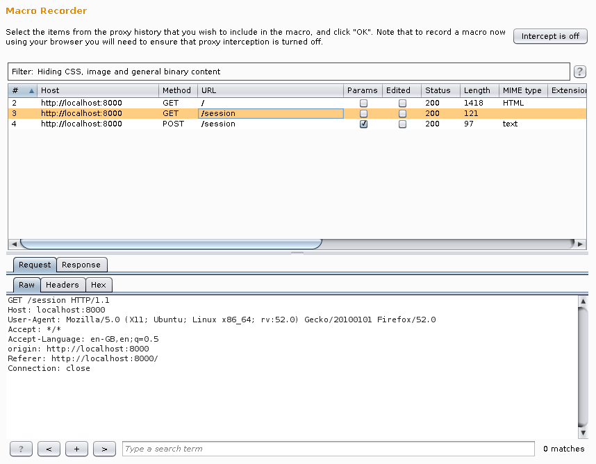
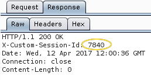
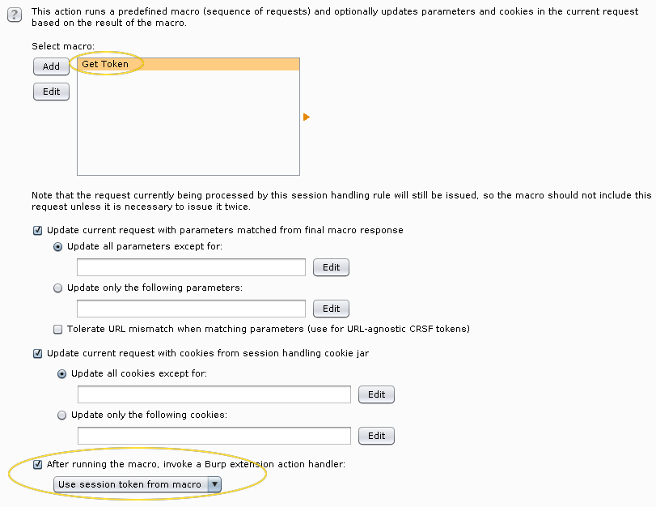
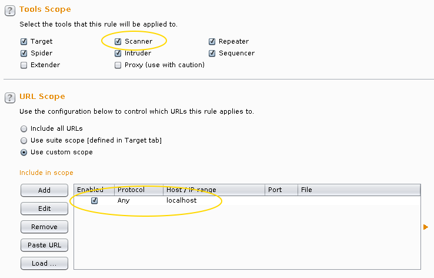
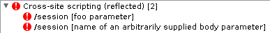

# Sample Burp Suite extension: Session Tokens

This example demonstrates how you can couple a recorded macro with an extension
to automatically gain a session token for a website and use it in later requests
that Burp makes.

The macro mechanism that Burp provides allows you to record the request
triggering creation of a session made via the proxy. To facilitate this demo we
provide a NodeJS server that allows you to inject XSS but only for a given
session.

First, to create the macro:

Burp / Project options / Sessions -> Macros -> Add



Upon inspection you can see in the response to the request that the webserver
provides a session token, in this case as a header named `X-Custom-Session-Id`.



Now you need to use this knowledge to build an extenion. By registering using
`callbacks.registerSessionHandlingAction(this);` and implementing the 
`ISessionHandlingAction` interface your extension can inspect the result of the
macro, provided in the second parameter of
```java
public void performAction(IHttpRequestResponse currentRequest, IHttpRequestResponse[] macroItems)
```
using this knowledge to alter the first parameter, i.e. the current request that
Burp is handling, which in this case will be a proxied request, but can rewrite
requests made by any of Burp's tools, e.g. the Scanner or Repeater.

Now to link these together in a Session handling rule:

Burp / Project options / Sessions -> Session Handling Rule -> Add Session handling rule



Now you can configure Burp to use this rule for Scanning and only when
browsing the local site:



Now, when performing an active scan in Burp, you will find XSS as Burp is able
to carry a custom session token across requests:


